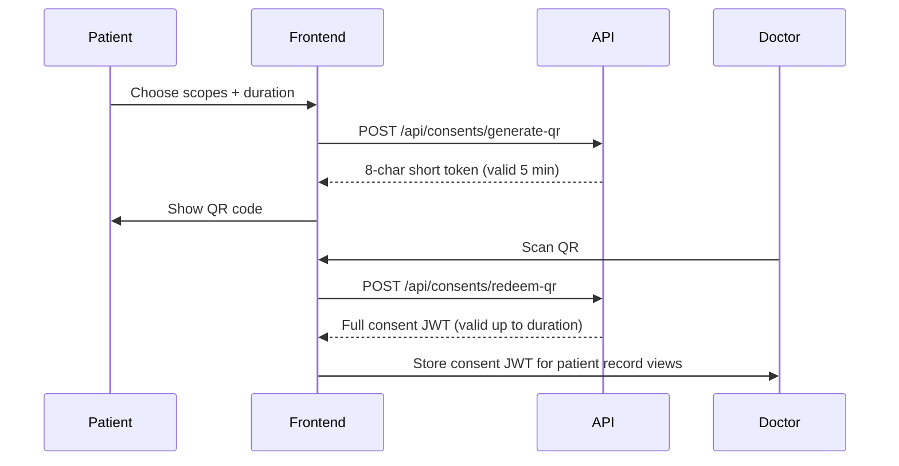
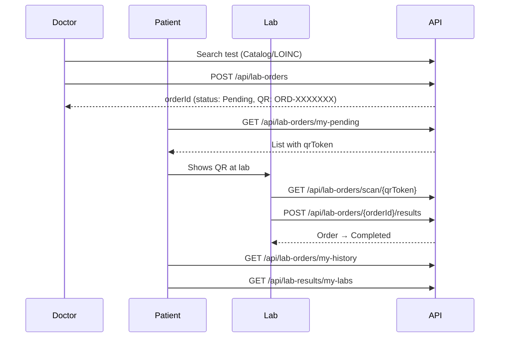
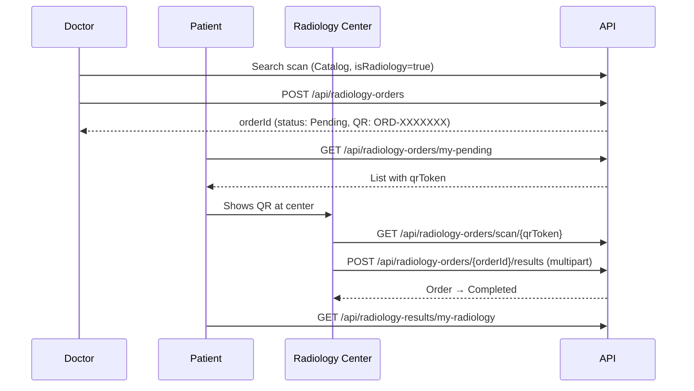

# Helix API — Frontend Guide: Lab Orders, Radiology & Consent

> **Main integration doc:** See [`FRONTEND_INTEGRATION_GUIDE.md`](./FRONTEND_INTEGRATION_GUIDE.md) for the complete screen-by-screen guide (auth, patient/doctor portals, UI design mapping). This file is the detailed appendix for lab, radiology, and consent modules.

This document explains how the frontend should call the backend endpoints for **lab orders**, **radiology orders**, and **patient consent**, including end-to-end workflows for each role.

---

## Table of Contents

1. [Quick Start](#quick-start)
2. [Response Format](#response-format)
3. [Authentication](#authentication)
4. [Consent Workflow](#consent-workflow)
5. [Lab Orders Workflow](#lab-orders-workflow)
6. [Radiology Workflow](#radiology-workflow)
7. [How Consent Connects to Lab & Radiology](#how-consent-connects-to-lab--radiology)
8. [Terminology Search (Order Creation)](#terminology-search-order-creation)
9. [Emergency Access (Break the Glass)](#emergency-access-break-the-glass)
10. [Order Status Reference](#order-status-reference)
11. [Frontend Integration Notes](#frontend-integration-notes)

---

## Quick Start

| Environment | Base URL |
|-------------|----------|
| Development (HTTP) | `http://localhost:5181` |
| Development (HTTPS) | `https://localhost:7193` |
| Swagger UI | `{baseUrl}/swagger` |

**Login:** `POST /api/auth/login` → returns a JWT used as:

```
Authorization: Bearer {loginJwt}
```

**Roles used in these modules:** `Patient`, `Doctor`, `Admin`, `Radiologist`

---

## Response Format

All endpoints return a wrapped response:

```json
{
  "statusCode": 200,
  "succeeded": true,
  "message": "Success message",
  "data": { },
  "errors": null,
  "meta": null
}
```

Always check `succeeded` and `message` before using `data`.

---

## Authentication

| Token type | How to get it | Where to send it |
|------------|---------------|------------------|
| **Login JWT** | `POST /api/auth/login` | `Authorization: Bearer {loginJwt}` |
| **Consent JWT** | Patient generates QR → Doctor redeems | See [Consent section](#consent-workflow) |
| **Short QR token** | `POST /api/consents/generate-qr` | 8-character string shown in patient's QR code |

### Important: Two ways consent is checked

The backend uses **different patterns** depending on the endpoint:

| Pattern | Endpoints | Frontend must send |
|---------|-----------|-------------------|
| **Header-based** | `GET /api/lab-orders/patient/{id}`<br>`GET /api/radiology-orders/patient/{id}` | Login JWT in `Authorization` **and** consent JWT in `X-Consent-Token` |
| **Bearer-claim-based** | `GET /api/lab-results/patient/{id}`<br>`GET /api/radiology-results/patient/{id}/radiology` | Consent JWT must be the **Authorization Bearer token** (login JWT alone will **not** pass) |

**Recommended approach for doctor views:**

1. Store login JWT and consent JWT separately after redeem.
2. For **order lists** → send both headers.
3. For **result lists** → temporarily swap `Authorization` to the consent JWT, or make a dedicated API call with consent JWT as Bearer.

---

## Consent Workflow

Consent lets a **patient** grant a **doctor** temporary access to specific record types (e.g. Labs, Radiology).



### Step 1 — Patient generates QR

**`POST /api/consents/generate-qr`**  
**Role:** `Patient`  
**Headers:** `Authorization: Bearer {patientLoginJwt}`

**Request body:**

```json
{
  "scopes": ["Labs", "Radiology"],
  "durationInMinutes": 120,
  "targetDoctorId": null
}
```

| Field | Type | Required | Notes |
|-------|------|----------|-------|
| `scopes` | `string[]` | Yes | Min 1 item. Use `"Labs"` and/or `"Radiology"` for these modules. Other scopes: `"Prescriptions"`, `"FullRecord"`, etc. |
| `durationInMinutes` | `number` | No | Default `120`. Range: `15`–`1440` (24 hours). |
| `targetDoctorId` | `Guid?` | No | If set, only that doctor can redeem the QR. |

**Response `data`:** 8-character short token (e.g. `"a1b2c3d4"`).  
**TTL:** Short token expires in **5 minutes**. Display as QR immediately.

---

### Step 2 — Doctor redeems QR

**`POST /api/consents/redeem-qr`**  
**Role:** `Doctor`  
**Headers:** `Authorization: Bearer {doctorLoginJwt}`

**Request body:** raw JSON string (the scanned token):

```json
"a1b2c3d4"
```

**Response `data`:** Full **consent JWT**. Store this in memory/session.  
**Rules:**
- QR is **single-use** — redeemed token is deleted from cache.
- A `Consent` record is created in the database with expiry from the JWT.

---

### Admin consent endpoints (optional)

| Method | Endpoint | Role | Purpose |
|--------|----------|------|---------|
| `GET` | `/api/consents/all` | Admin | List all consents |
| `GET` | `/api/consents/{id}` | Admin | Get consent by ID |
| `POST` | `/api/consents` | Admin | Create consent manually |
| `PUT` | `/api/consents/{id}` | Admin | Update consent |
| `DELETE` | `/api/consents/{id}` | Admin | Delete consent |

---

## Lab Orders Workflow



### Doctor — Create lab order

**1. Search for a test**

```
GET /api/Catalog/search?searchTerm=hemoglobin&isRadiology=false
```

**2. Create order**

**`POST /api/lab-orders`**  
**Role:** `Doctor`

```json
{
  "patientId": "00000000-0000-0000-0000-000000000001",
  "doctorId": "00000000-0000-0000-0000-000000000002",
  "terminologyCode": "718-7"
}
```

> `doctorId` in the body is **overwritten** from the logged-in doctor's JWT. You can send any valid GUID.

**Response `data`:** New order `Guid`.

**Side effect:** If the terminology code is a LOINC **panel**, the backend auto-creates empty result slots for each panel component.

---

### Patient — View pending orders (show QR at lab)

**`GET /api/lab-orders/my-pending`**  
**Role:** `Patient`

**Response `data`:** `PendingLabOrderDto[]`

```typescript
{
  orderId: Guid;
  testName: string;
  qrToken: string;      // Format: ORD-XXXXXXX (7 hex chars)
  createdAt: DateTime;
  status: string;       // "Pending"
}
```

---

### Patient — View order history

| Endpoint | Purpose |
|----------|---------|
| `GET /api/lab-orders/my-history` | All orders (summary) |
| `GET /api/lab-orders/{orderId}` | Single order with full panel results |
| `GET /api/lab-results/my-labs` | Flat list of all lab test results |

**Role:** `Patient` for all above.

---

### Lab staff — Scan QR & upload results

**Scan order**

**`GET /api/lab-orders/scan/{qrToken}`**  
**Auth:** Currently **no auth required** (commented out in backend).

**Response `data`:** `LabOrderDto` with empty `results` slots for panel tests.

**Upload results**

**`POST /api/lab-orders/{orderId}/results`**  
**Auth:** Currently **no auth required**  
**Content-Type:** `application/json`

```json
{
  "orderId": "00000000-0000-0000-0000-000000000003",
  "results": [
    {
      "medicalConceptId": "00000000-0000-0000-0000-000000000010",
      "numericValue": 14.2,
      "stringValue": null,
      "unit": "g/dL",
      "referenceRange": "13.5 - 17.5",
      "interpretationFlag": "Normal"
    }
  ]
}
```

| Field | Notes |
|-------|-------|
| `medicalConceptId` | Identifies which panel slot to fill (from scan response) |
| `numericValue` / `stringValue` | Use one or the other depending on result type |
| `interpretationFlag` | e.g. `"High"`, `"Low"`, `"Abnormal"`, `"Normal"` |

**On success:** Order status becomes `Completed`.

**Rules:**
- Only `Pending` orders can be scanned and uploaded.
- Only `Pending` orders can be updated by the doctor.

---

### Doctor — View own orders

**`GET /api/lab-orders/my-orders`**  
**Role:** `Doctor`

Returns `LabOrderDto[]` for orders created by the logged-in doctor.

---

### Doctor — View patient lab orders (requires consent)

**`GET /api/lab-orders/patient/{patientId}`**  
**Role:** `Doctor`

**Headers:**
```
Authorization: Bearer {doctorLoginJwt}
X-Consent-Token: {consentJwt}
```

Consent JWT must include scope `"Labs"` for the requested `patientId`.

**Response `data`:** `LabOrderDto[]`

---

### Doctor — View patient lab results (requires consent)

**`GET /api/lab-results/patient/{patientId}`**  
**Role:** `Doctor`

**Headers:**
```
Authorization: Bearer {consentJwt}
```

Or use emergency access (see below). Login JWT alone will **not** work.

**Response `data`:** `LabTestResultDto[]`

```typescript
{
  resultId: Guid;
  medicalConceptId: Guid;
  testCode: string;         // e.g. "718-7"
  testName: string;         // e.g. "Hemoglobin"
  status: string;
  numericValue?: number;
  stringValue?: string;
  unit?: string;
  referenceRange?: string;
  interpretationFlag?: string;
  resultDate?: DateTime;
}
```

---

### Lab order — Other endpoints

| Method | Endpoint | Role | Notes |
|--------|----------|------|-------|
| `PUT` | `/api/lab-orders/{id}` | Doctor | Update pending order. Body: `{ "id": Guid, "terminologyCode": "..." }` |
| `GET` | `/api/lab-orders/{id}` | Admin, Doctor, Patient | Full order with results |
| `GET` | `/api/lab-orders/all` | Admin | All orders |
| `PUT` | `/api/lab-orders/{id}/status/{newStatus}` | Admin | Manual status change |
| `DELETE` | `/api/lab-orders/{id}` | Admin | Delete order |

---

## Radiology Workflow



### Doctor — Create radiology order

**1. Search for a scan**

```
GET /api/Catalog/search?searchTerm=mri&isRadiology=true
```

**2. Create order**

**`POST /api/radiology-orders`**  
**Role:** `Doctor`

```json
{
  "patientId": "00000000-0000-0000-0000-000000000001",
  "doctorId": "00000000-0000-0000-0000-000000000002",
  "terminologyCode": "70551"
}
```

**Response `data`:** New order `Guid`.

---

### Patient — View pending orders (show QR)

**`GET /api/radiology-orders/my-pending`**  
**Role:** `Patient`

**Response `data`:** `PendingRadiologyOrderDto[]`

```typescript
{
  id: Guid;
  patientName: string;
  requestingDoctorName: string;
  terminologyDisplay: string;  // e.g. "MRI Brain without contrast"
  qrToken: string;             // ORD-XXXXXXX
  createdAt: DateTime;
}
```

> There is **no** `my-history` endpoint for radiology orders. Use `GET /api/radiology-results/my-radiology` for completed reports.

---

### Patient — View radiology results

| Endpoint | Purpose |
|----------|---------|
| `GET /api/radiology-results/my-radiology` | All patient's radiology reports |
| `GET /api/radiology-results/order/{orderId}` | Result for a specific order |

**Role:** `Patient` (for `my-radiology`). `order/{orderId}` requires any authenticated user.

---

### Radiology staff — Scan QR & upload report

**Scan order**

**`GET /api/radiology-orders/scan/{qrToken}`**  
**Role:** `Admin` or `Radiologist`

**Response `data`:** `RadiologyOrderDto`

**Upload report + images**

**`POST /api/radiology-orders/{orderId}/results`**  
**Role:** `Admin` or `Radiologist`  
**Content-Type:** `multipart/form-data` (not JSON)

| Form field | Type | Required | Notes |
|------------|------|----------|-------|
| `orderId` | Guid | Yes | Set from URL; can also be in form |
| `findings` | string | Yes | Report findings text |
| `impression` | string | Yes | Report impression/conclusion |
| `externalRadiologistName` | string | No | Name of external radiologist |
| `images` | File[] | No | One or more image files |

**Example (JavaScript FormData):**

```javascript
const formData = new FormData();
formData.append('findings', 'No acute intracranial abnormality.');
formData.append('impression', 'Normal MRI brain.');
formData.append('externalRadiologistName', 'Dr. Smith');
formData.append('images', file1);
formData.append('images', file2);

await fetch(`${baseUrl}/api/radiology-orders/${orderId}/results`, {
  method: 'POST',
  headers: { Authorization: `Bearer ${token}` },
  body: formData
});
```

**On success:** Order status becomes `Completed`.

---

### Doctor — View own radiology orders

**`GET /api/radiology-orders/my-orders`**  
**Role:** `Doctor`

---

### Doctor — View patient radiology orders (requires consent)

**`GET /api/radiology-orders/patient/{patientId}`**  
**Role:** `Doctor`

**Headers:**
```
Authorization: Bearer {doctorLoginJwt}
X-Consent-Token: {consentJwt}
```

Consent JWT must include scope `"Radiology"` for the requested patient.  
If `targetDoctorId` was set at QR generation, the redeeming doctor must match.

**Fallback:** Emergency access also works for this endpoint.

---

### Doctor — View patient radiology results (requires consent)

**`GET /api/radiology-results/patient/{patientId}/radiology`**  
**Role:** `Doctor`

**Headers:**
```
Authorization: Bearer {consentJwt}
```

Or use emergency access.

**Response `data`:** `RadiologyTestResultDto[]`

```typescript
{
  id: Guid;
  orderId: Guid;
  patientId: Guid;
  patientName: string;
  terminologyCodeId: Guid;
  terminologyDisplay: string;
  findings: string;
  impression: string;
  performedDate: DateTime;
  images: {
    id: Guid;
    filePath: string;   // prepend base URL for display
    fileName: string;
    label?: string;
  }[];
}
```

---

### Radiology order — Other endpoints

| Method | Endpoint | Role | Notes |
|--------|----------|------|-------|
| `PUT` | `/api/radiology-orders/{id}` | Doctor | Update pending order |
| `GET` | `/api/radiology-orders/{id}` | Admin | Single order details |
| `GET` | `/api/radiology-orders/all` | Admin | All orders |
| `PUT` | `/api/radiology-orders/{id}/status/{newStatus}` | Admin, Radiologist | Manual status change |
| `DELETE` | `/api/radiology-orders/{id}` | Admin | Delete order |
| `PUT` | `/api/radiology-results/{id}` | Doctor, Admin | Update findings/impression |
| `DELETE` | `/api/radiology-results/{id}` | Admin | Delete result + images |

---

## How Consent Connects to Lab & Radiology

| What doctor wants to see | Required consent scope | Endpoint | How to send consent |
|--------------------------|------------------------|----------|---------------------|
| Patient's lab **orders** | `"Labs"` | `GET /api/lab-orders/patient/{id}` | `X-Consent-Token` header |
| Patient's lab **results** | `"Labs"` | `GET /api/lab-results/patient/{id}` | Consent JWT as `Authorization` Bearer |
| Patient's radiology **orders** | `"Radiology"` | `GET /api/radiology-orders/patient/{id}` | `X-Consent-Token` header |
| Patient's radiology **results** | `"Radiology"` | `GET /api/radiology-results/patient/{id}/radiology` | Consent JWT as `Authorization` Bearer |

**Typical doctor UI flow:**

1. Doctor opens patient chart.
2. If no active consent → prompt patient to show consent QR.
3. Doctor scans QR → call `redeem-qr` → store consent JWT keyed by `patientId`.
4. Load lab/radiology tabs using the correct header pattern per endpoint.

**Generate QR with both scopes at once:**

```json
{
  "scopes": ["Labs", "Radiology"],
  "durationInMinutes": 120
}
```

---

## Terminology Search (Order Creation)

Used by doctors when creating lab or radiology orders.

**`GET /api/Catalog/search`**  
**Auth:** None  
**Query params:**

| Param | Type | Notes |
|-------|------|-------|
| `searchTerm` | string | Min 2 characters |
| `isRadiology` | bool? | `false` or omit → lab tests. `true` → radiology scans |

**Response:** `ConceptSearchDto[]` (raw array, not wrapped in `Response<T>`)

```typescript
{
  conceptId: Guid;
  code: string;
  displayName: string;
  isPanel: boolean;      // true = LOINC panel (lab only)
  isRadiology: boolean;
}
```

---

## Emergency Access (Break the Glass)

When consent is unavailable in an emergency, a doctor can request temporary override access (12 hours).

**`POST /api/emergency-access/break-the-glass`**  
**Role:** `Doctor`

```json
{
  "patientId": "00000000-0000-0000-0000-000000000001",
  "reason": "Patient unconscious, need immediate lab history"
}
```

| Field | Notes |
|-------|-------|
| `reason` | Should be meaningful (audit trail). Recommend min 15 characters in UI validation. |

**Works as fallback on:**
- `GET /api/radiology-orders/patient/{id}`
- `GET /api/radiology-results/patient/{id}/radiology`
- `GET /api/lab-results/patient/{id}`

**Does NOT work on:**
- `GET /api/lab-orders/patient/{id}` (consent only)

---

## Order Status Reference

Both lab and radiology orders use the same status values:

| Status | Meaning |
|--------|---------|
| `Pending` | Created, waiting for scan center. Editable by doctor. Scannable. |
| `InProgress` | Being processed |
| `Abnormal` | Results flagged abnormal |
| `Completed` | Results uploaded |

**Transitions:**
- Create → `Pending`
- Upload results → `Completed`
- Admin/Radiologist can manually change via `PUT .../status/{newStatus}`

**QR token format:** `ORD-` + 7 uppercase hex characters (e.g. `ORD-A1B2C3D`)

---

## Frontend Integration Notes

### 1. Consent header vs Bearer mismatch

Order-list endpoints use `X-Consent-Token`. Result-list endpoints check consent claims on the **Bearer** token. Plan your HTTP client accordingly.

### 2. Forbidden may return HTTP 400

The `AppControllerBase` response mapper does not map `403 Forbidden` to HTTP 403. A forbidden consent error may arrive as **HTTP 400** with `succeeded: false` and a forbidden message in `message`.

### 3. Lab scan/upload is currently public

`GET /api/lab-orders/scan/{qrToken}` and `POST /api/lab-orders/{orderId}/results` have auth commented out. Radiology equivalents require `Admin` or `Radiologist`.

### 4. Radiologist role

Radiology specialist endpoints authorize `"Admin,Radiologist"`. Confirm the `Radiologist` role exists in your environment's identity seeding.

### 5. Radiology image URLs

Uploaded images return `filePath` in the DTO. Prepend the API base URL to build the full image URL (static files are served from the backend).

### 6. URL/body ID mismatch

`PUT` endpoints return `400` if the `id` in the URL does not match the `id` in the request body.

### 7. Panel lab orders

When creating a panel order, the scan response includes multiple empty `results` slots. The lab must fill each slot using the correct `medicalConceptId` from the scan response.

---

## Endpoint Summary Tables

### Consent

| Method | Endpoint | Role |
|--------|----------|------|
| `POST` | `/api/consents/generate-qr` | Patient |
| `POST` | `/api/consents/redeem-qr` | Doctor |

### Lab Orders

| Method | Endpoint | Role |
|--------|----------|------|
| `GET` | `/api/lab-orders/my-pending` | Patient |
| `GET` | `/api/lab-orders/my-history` | Patient |
| `GET` | `/api/lab-orders/scan/{qrToken}` | Public |
| `POST` | `/api/lab-orders/{orderId}/results` | Public |
| `GET` | `/api/lab-orders/patient/{patientId}` | Doctor + consent |
| `GET` | `/api/lab-orders/my-orders` | Doctor |
| `POST` | `/api/lab-orders` | Doctor |
| `PUT` | `/api/lab-orders/{id}` | Doctor |
| `GET` | `/api/lab-orders/{id}` | Admin, Doctor, Patient |

### Lab Results

| Method | Endpoint | Role |
|--------|----------|------|
| `GET` | `/api/lab-results/my-labs` | Patient |
| `GET` | `/api/lab-results/patient/{patientId}` | Doctor + consent |

### Radiology Orders

| Method | Endpoint | Role |
|--------|----------|------|
| `GET` | `/api/radiology-orders/my-pending` | Patient |
| `GET` | `/api/radiology-orders/scan/{qrToken}` | Admin, Radiologist |
| `POST` | `/api/radiology-orders/{orderId}/results` | Admin, Radiologist |
| `GET` | `/api/radiology-orders/patient/{patientId}` | Doctor + consent |
| `GET` | `/api/radiology-orders/my-orders` | Doctor |
| `POST` | `/api/radiology-orders` | Doctor |
| `PUT` | `/api/radiology-orders/{id}` | Doctor |

### Radiology Results

| Method | Endpoint | Role |
|--------|----------|------|
| `GET` | `/api/radiology-results/my-radiology` | Patient |
| `GET` | `/api/radiology-results/order/{orderId}` | Authenticated |
| `GET` | `/api/radiology-results/patient/{patientId}/radiology` | Doctor + consent |

### Supporting

| Method | Endpoint | Role |
|--------|----------|------|
| `POST` | `/api/auth/login` | Public |
| `GET` | `/api/Catalog/search` | Public |
| `POST` | `/api/emergency-access/break-the-glass` | Doctor |

---

*Last updated: June 2026 — HelixAPISN backend*
