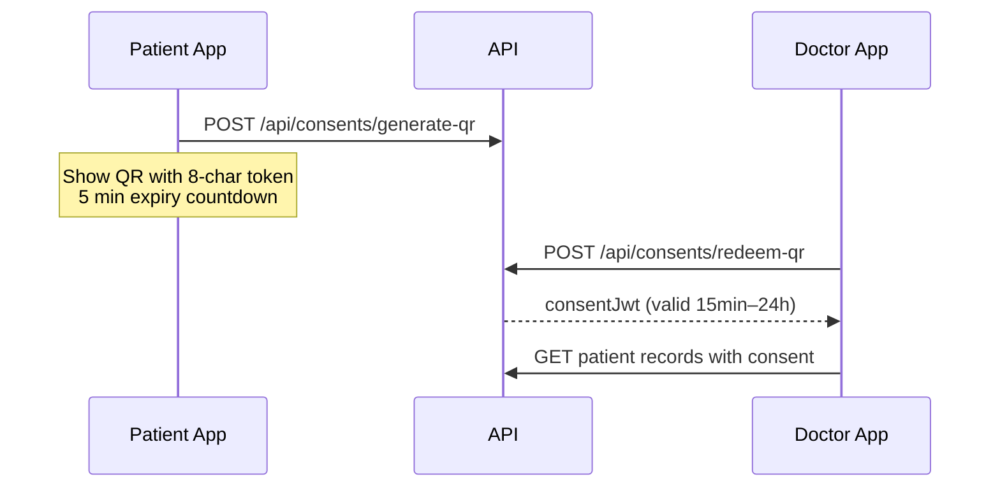
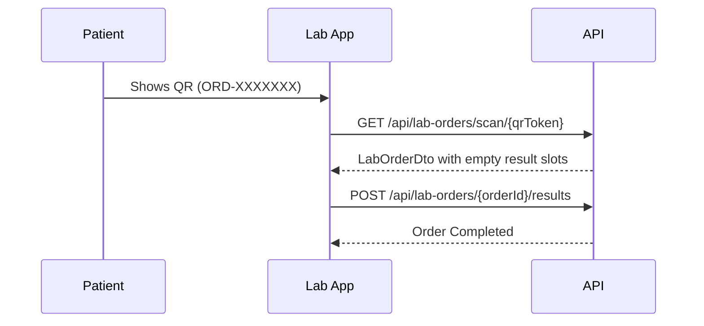

# Helix / Healix — Complete Frontend Integration Guide

This document is the **single integration reference** for frontend developers. It maps every UI screen from the design specs to the HelixAPISN backend endpoints, request/response shapes, and workflows.

**UI design references (source of truth for screens):**
- `gemini-code-1782771615095.md` — UI/UX data requirements by portal
- `New Microsoft Word Document.md` — Full screen-by-screen descriptions (Patient, Doctor, Pharmacy journeys)

**Detailed lab / radiology / consent API reference:**
- `FRONTEND_API_LAB_RADIOLOGY_CONSENT.md` — Deep dive on those three modules

---

## Table of Contents

1. [Environment & Setup](#1-environment--setup)
2. [Global API Conventions](#2-global-api-conventions)
3. [Recommended Frontend Architecture](#3-recommended-frontend-architecture)
4. [Authentication & Onboarding](#4-authentication--onboarding)
5. [Consent System (QR Access)](#5-consent-system-qr-access)
6. [Patient Portal — Screen Integration](#6-patient-portal--screen-integration)
7. [Doctor Portal — Screen Integration](#7-doctor-portal--screen-integration)
8. [Lab Specialist Portal](#8-lab-specialist-portal)
9. [Radiology Portal](#9-radiology-portal)
10. [Pharmacy Portal](#10-pharmacy-portal)
11. [Shared Features (AI Chat, Files, Catalogs)](#11-shared-features)
12. [End-to-End Workflows](#12-end-to-end-workflows)
13. [Consent Scopes Reference](#13-consent-scopes-reference)
14. [UI Field → API Field Mapping](#14-ui-field--api-field-mapping)
15. [Gaps & Limitations](#15-gaps--limitations)

---

## 1. Environment & Setup

| Environment | Base URL |
|-------------|----------|
| Development HTTP | `http://localhost:5181` |
| Development HTTPS | `https://localhost:7193` |
| Swagger (explore all endpoints) | `{baseUrl}/swagger` |

Configure one `API_BASE_URL` in your frontend environment file and use it for all requests.

---

## 2. Global API Conventions

### 2.1 Response wrapper

Most endpoints return:

```json
{
  "statusCode": 200,
  "succeeded": true,
  "message": "Success message",
  "data": { },
  "errors": null,
  "meta": null
}
```

**Always check `succeeded` before using `data`.**

Exceptions (raw JSON, no wrapper):
- `GET /api/Catalog/search`
- `GET /api/MedicationCatalog/search`
- `GET /api/AllergenCatalog/search`
- `GET /api/ChronicDiseaseCatalog/search`
- `GET /api/SpecialtyCatalog/search`

### 2.2 Authentication headers

| Token | Header | Used for |
|-------|--------|----------|
| Login JWT | `Authorization: Bearer {loginJwt}` | All authenticated routes |
| Consent JWT | `X-Consent-Token: {consentJwt}` | Doctor viewing patient **order lists** |
| Consent JWT as Bearer | `Authorization: Bearer {consentJwt}` | Doctor viewing patient **result lists** and some profile endpoints |

### 2.3 Roles

Backend roles (`EnRoles`):

| Role | UI portal |
|------|-----------|
| `Patient` | Patient app |
| `Doctor` | Doctor app |
| `Admin` | Admin panel |
| `Pharmaciest` | Pharmacy (registration role: `RegisterAsPharmaciest`) |
| `LabSpecialist` | Lab staff |
| `Radiologist` | Referenced in radiology endpoints (may need seeding) |

Registration uses `RegisterAs`: `RegisterAsPatient`, `RegisterAsDoctor`, `RegisterAsPharmaciest`, `RegisterAsLabSpecialist`.

### 2.4 HTTP status quirk

`403 Forbidden` from consent checks may arrive as **HTTP 400** with `succeeded: false` and a forbidden message in `message`. Handle by message content, not only status code.

---

## 3. Recommended Frontend Architecture

### 3.1 Token storage

```typescript
interface AuthState {
  loginJwt: string;
  userId: string;
  roles: string[];
}

interface ConsentState {
  // Keyed by patientId — doctor may have multiple active consents
  [patientId: string]: {
    consentJwt: string;
    expiresAt: Date;
    scopes: string[];
  };
}
```

Store in memory + secure session storage. Never put tokens in URL query params.

### 3.2 HTTP interceptor pattern

```typescript
// Default: attach login JWT
config.headers.Authorization = `Bearer ${authState.loginJwt}`;

// Doctor patient views: attach consent header when needed
if (endpointNeedsConsentHeader) {
  config.headers['X-Consent-Token'] = consentState[patientId].consentJwt;
}

// Result endpoints: swap Bearer to consent JWT
if (endpointNeedsConsentBearer) {
  config.headers.Authorization = `Bearer ${consentState[patientId].consentJwt}`;
}
```

### 3.3 API service modules (suggested)

| Service file | Covers |
|--------------|--------|
| `auth.service.ts` | Login, register, email confirm, password |
| `consent.service.ts` | Generate QR, redeem QR |
| `patient.service.ts` | Profile, onboarding |
| `doctor.service.ts` | Profile, directory search |
| `appointment.service.ts` | Scheduling, dashboard |
| `lab-order.service.ts` | Lab orders & results |
| `radiology.service.ts` | Radiology orders & results |
| `prescription.service.ts` | Prescriptions, clinical summary |
| `medication.service.ts` | Patient medications |
| `catalog.service.ts` | Search tests, drugs, allergens |
| `chatbot.service.ts` | AI assistant |
| `file.service.ts` | Document upload/download |

---

## 4. Authentication & Onboarding

### 4.1 Screen mapping

| UI Screen (Word doc #) | UI data needed | API |
|------------------------|----------------|-----|
| 3 — Role Selection | Patient / Doctor / Pharmacy | Frontend only — pass role to register |
| 4 — Patient Sign Up | Email, password, name | `POST /api/auth/register` |
| 5 — Email Verification | 6-digit OTP | `POST /api/auth/confirm-email` |
| 6 — Welcome / Profile Setup | Name, verified status | `GET /api/auth/profile/{userId}` |
| 7–9 — Patient Onboarding | Medical info, emergency, insurance | `POST /api/patients/register-patient` |
| 18–21 — Doctor Onboarding | Personal, professional, availability | `POST /api/doctors/register-doctor` |
| 29–31 — Pharmacy Registration | Account + pharmacy details | `POST /api/auth/register` + facility (partial) |

---

### 4.2 Register account

**`POST /api/auth/register`**  
**Content-Type:** `multipart/form-data`

| Field | Type | Required | Notes |
|-------|------|----------|-------|
| `Username` | string | Yes | Min 3 chars |
| `Email` | string | Yes | Valid email |
| `Password` | string | Yes | Min 6 chars |
| `RegisterAs` | enum | Yes | `RegisterAsPatient`, `RegisterAsDoctor`, etc. |

**Response `data`:**

```typescript
{
  userId: string;
  accessToken: string;
  roles?: string[];
}
```

After register, user receives email confirmation code. Show Screen #5 (Email Verification).

---

### 4.3 Confirm email (Screen #5)

**`POST /api/auth/confirm-email`**

```json
{
  "userEmail": "patient@example.com",
  "code": "123456"
}
```

**Resend:** `POST /api/auth/resend-confirmation-email?Email={email}`

---

### 4.4 Login (all portals)

**`POST /api/auth/login`**

```json
{
  "emailAddress": "patient@example.com",
  "password": "yourPassword"
}
```

**Response `data`:**

```typescript
{
  userId: string;
  accessToken: string;
  roles: string[];   // e.g. ["Patient"]
}
```

Store `accessToken` and route by role:
- `Patient` → Patient dashboard
- `Doctor` → Doctor dashboard
- `Admin` / `LabSpecialist` / `Pharmaciest` → respective portal

**Note:** Login fails if email not confirmed. Backend auto-resends confirmation email on failed login due to unconfirmed email.

---

### 4.5 Patient onboarding (Screens #7–9)

After auth register, complete patient profile:

**`POST /api/patients/register-patient`**  
**Role:** Any (typically right after register)  
**Content-Type:** `multipart/form-data`

| UI field (Screen #7–9) | API field |
|------------------------|-----------|
| Full name | `FullName` |
| National ID | `NationalId` |
| Phone | `PhoneNumber` |
| Profile photo | `ProfileImage` (file) |
| Blood type | `BloodType` (enum `EnBloodTypes`) |
| Medical conditions | `ChronicDiseasesCode[]` — use catalog codes |
| Past surgeries | `SurgeriesCode[]` |
| Allergies | `AllergiesCode[]` — from allergen catalog |
| Current medications | `CurrentMedicationsCode[]` |
| Emergency contact name | `EmergencyContactName` |
| Emergency contact phone | `EmergencyContactPhoneNumber` |
| Insurance provider | `InsuranceProvider` |
| Insurance policy ID | `InsurancePolicyNumber` |
| App user link | `AppUserId` — from register response `userId` |

**Catalog lookups for onboarding:**

| Data | Endpoint |
|------|----------|
| Chronic diseases | `GET /api/ChronicDiseaseCatalog/search?searchTerm=diabetes` |
| Top chronic diseases | `GET /api/ChronicDiseaseCatalog/top` |
| Allergens | `GET /api/AllergenCatalog/search?searchTerm=penicillin` |
| Medications | `GET /api/MedicationCatalog/search?query=aspirin` |

---

### 4.6 Doctor onboarding (Screens #18–21)

**`POST /api/doctors/register-doctor`**  
**Content-Type:** `multipart/form-data`

| UI field | API field |
|----------|-----------|
| Full name | `FullName` |
| National ID | `NationalId` |
| Phone | `PhoneNumber` |
| Specialty | `SpecialtyCatalogCode` — from `GET /api/SpecialtyCatalog/search` |
| License number | `MedicalLicenseNumber` |
| License document | `MedicalLicenseDocument` (file) |
| National ID document | `NationalIdDocument` (file) |
| Profile photo | `ProfileImage` (file) |
| Country / State | `Country`, `State` |
| Clinic address | `ClinicAddress` |
| Years of experience | `YearsOfExperience` |
| Consultation fee | `ConsultationFee` |
| Consultation type | `ConsultationType` |
| Available days | `AvailabeDays` |
| Time slots | `AvailableTimeSlotsJson[]` — JSON strings per slot |
| App user link | `AppUserId` |

Screen #22 (Submission Successful) — frontend-only confirmation; no dedicated API.

---

### 4.7 Get profile after login

| Role | Endpoint |
|------|----------|
| Patient | `GET /api/patients/my-profile` |
| Doctor | `GET /api/doctors/my-profile` |
| Any | `GET /api/auth/profile/{userId}` |

**PatientDto** (maps to Screen #25 patient header, sidebar):

```typescript
{
  id: Guid;
  fullName: string;
  nationalId: string;
  phoneNumber: string;
  email: string;
  bloodType?: string;
  chronicDiseases: string[];
  medication: string[];
  surgeries: string[];
  allergies: string[];
  insurance?: { provider, policyNumber, ... };
  emergencyContacts: { name, phone, relationship }[];
}
```

---

## 5. Consent System (QR Access)

Maps to UI screens:
- **Screen #12** — Patient Access QR Code
- **Screen #28** — Doctor QR Code Scan
- **Screen #2.2** (gemini doc) — Patient Profile unlocked via QR

### 5.1 How it works



### 5.2 Patient generates QR (Screen #12)

**`POST /api/consents/generate-qr`**  
**Role:** `Patient`

**UI elements → API:**

| UI element | API / logic |
|------------|-------------|
| Patient name | From `GET /api/patients/my-profile` → `fullName` |
| Patient ID display (e.g. PT-2026-001) | Format from `patient.id` on frontend |
| Access code (e.g. MED-8X067AJK) | Response `data` = 8-char token |
| QR code image | Encode `data` string into QR |
| Expiry timer (design: 2 hours) | **QR token TTL = 5 minutes**. Consent JWT TTL = user-selected duration (default 120 min) |

**Request body:**

```json
{
  "scopes": ["Labs", "Radiology", "Prescriptions", "Demographics", "Medications"],
  "durationInMinutes": 120,
  "targetDoctorId": null
}
```

**Scope picker UI:** Let patient choose which record types to share. Minimum 1 scope required.

---

### 5.3 Doctor scans QR (Screen #28)

**`POST /api/consents/redeem-qr`**  
**Role:** `Doctor`

**Request body:** raw JSON string of scanned token:

```json
"a1b2c3d4"
```

**Response `data`:** Full consent JWT — store keyed by `patientId` extracted from JWT claims.

After redeem, navigate to **Doctor Patient Profile (Screen #25)** and load data using consent (see Section 13).

---

## 6. Patient Portal — Screen Integration

### Screen #10 — Patient Dashboard

| UI KPI / section | API source | Notes |
|------------------|------------|-------|
| Greeting + name | `GET /api/patients/my-profile` | `fullName` |
| Active prescriptions count | `GET /api/medications/my-medications` | Count array length |
| Upcoming appointments | ⚠️ No patient appointment list endpoint yet | Use placeholder or future endpoint |
| Recent activity — Lab results | `GET /api/lab-results/my-labs` | Map `testName`, `resultDate` |
| Recent activity — Radiology | `GET /api/radiology-results/my-radiology` | Map `terminologyDisplay`, `performedDate` |
| Health score (85/100) | ⚠️ Not in API | Frontend mock or future AI endpoint |
| Health tips | ⚠️ Not in API | Static or from chatbot |
| Quick action: Generate QR | Navigate to Screen #12 | `POST /api/consents/generate-qr` |
| Quick action: Schedule Appointment | Screen #13 | See appointments section |
| AI Assistant prompt | `POST /api/chatbot/ask` | See Section 11 |

---

### Screen #11 — Patient Profile Sidebar

Navigation → API module:

| Nav item | Primary API |
|----------|-------------|
| Dashboard | Multiple (see #10) |
| Medical Records | Aggregated from labs + radiology + diagnoses |
| Lab Tests | `GET /api/lab-orders/my-history`, `GET /api/lab-results/my-labs` |
| Radiology | `GET /api/radiology-results/my-radiology`, `GET /api/radiology-orders/my-pending` |
| Prescriptions | `GET /api/medications/my-medications` |
| Uploaded Documents | `POST /api/files/upload`, list via file paths stored in patient records |

---

### Screen #12 — Patient Access QR Code

See [Section 5.2](#52-patient-generates-qr-screen-12).

---

### Screen #13 — Schedule Appointment

| Step | API |
|------|-----|
| Search doctors | `GET /api/doctors/all` or `GET /api/doctors/search/name?name=` |
| Search by specialty | `GET /api/doctors/search/specialty?specialty=` |
| Pick date → load slots | `GET /api/appointments/doctor/{doctorId}/slots?date=2026-06-27` |
| Book appointment | `POST /api/appointments` |

**CreateAppointmentDto:**

```json
{
  "patientId": "guid-from-my-profile",
  "doctorId": "selected-doctor-guid",
  "startTime": "2026-06-27T09:00:00",
  "endTime": "2026-06-27T09:30:00",
  "appointmentType": "In-person Follow-up",
  "priority": "Routine",
  "patientInstruction": "Chest pain follow-up"
}
```

**DoctorAvailabilityDto response:**

```typescript
{
  weeklyAvailability: { date, hasSlots, slotCount }[];
  selectedDaySlots: { startTime, endTime, isBooked }[];
}
```

Render calendar dots from `weeklyAvailability`. Render time buttons from `selectedDaySlots` (disable booked slots).

---

### Screen #14 — Medical Records (Lab Tests)

**List view:**

| UI column | API field |
|-----------|-----------|
| Test name | `testName` from `LabOrderDto` or `LabTestResultDto` |
| Date | `createdAt` (orders) or `resultDate` (results) |
| Ordering physician | ⚠️ Not on list DTO — show from order detail |
| Status | `status` — `Pending`, `Completed`, `Abnormal` |

**Endpoints:**

```
GET /api/lab-orders/my-history          → order list
GET /api/lab-orders/{orderId}           → detail with panel results
GET /api/lab-results/my-labs            → flat result list
```

**Detail view (tabular bloodwork):**

From `GET /api/lab-orders/{orderId}` → `data.results[]`:

| UI column | API field |
|-----------|-----------|
| Parameter | `testName` |
| Result | `numericValue` or `stringValue` |
| Normal range | `referenceRange` |
| Flag | `interpretationFlag` — `"High"`, `"Low"`, `"Abnormal"` |

**Pending orders with QR (patient at lab):**

```
GET /api/lab-orders/my-pending
```

Response includes `qrToken` (format `ORD-XXXXXXX`) — display as QR for lab staff.

---

### Screen #15 — Radiology Management

**List view:**

```
GET /api/radiology-results/my-radiology     → completed reports
GET /api/radiology-orders/my-pending          → pending scans with QR
```

| UI column | API field |
|-----------|-----------|
| Scan type | `terminologyDisplay` |
| Date | `performedDate` or `createdAt` |
| Requesting physician | From pending order: `requestingDoctorName` |
| Status | Order `status` or infer from result existence |
| Radiologist notes | `findings` + `impression` |
| Scan preview | `images[].filePath` — prepend `API_BASE_URL` |

**Detail view:**

```
GET /api/radiology-results/order/{orderId}
```

**KPI cards** (Total scans, Pending, Recent uploads) — compute client-side from list data or ⚠️ use placeholder until admin stats endpoint exists.

---

### Screen #16 — Uploaded Documents

| Action | API |
|--------|-----|
| Upload | `POST /api/files/upload` (multipart) |
| Upload multiple | `POST /api/files/upload-multiple` |
| Download | `GET /api/files/download/{filePath}` |
| Delete | `DELETE /api/files/{filePath}` |

Store returned `filePath` in your document list (local state or future patient-documents endpoint).

---

### Screen #17 — Prescriptions Management

```
GET /api/medications/my-medications
```

Map `MedicationDto` to UI: medication name, dosage, frequency, duration, prescribing doctor, date, status.

---

## 7. Doctor Portal — Screen Integration

### Screen #23 — Doctor Dashboard

| UI KPI | API | Field |
|--------|-----|-------|
| Today's appointments | `GET /api/appointments/dashboard/today` | Count `data.length` |
| Schedule summary | `GET /api/appointments/dashboard/summary` | `totalAppointments`, `confirmed`, `waiting`, `urgent` |
| Pending labs | `GET /api/lab-orders/my-orders` | Filter `status === "Pending"` |
| Today's appointment list | `GET /api/appointments/dashboard/today` | See `AppointmentListDto` |
| Doctor name / specialty | `GET /api/doctors/my-profile` | `fullName`, `specialty` |

**AppointmentListDto → UI badge:**

| API | UI badge |
|-----|----------|
| `badgeText` | Use directly ("Upcoming", "Waiting", "Completed", "Urgent") |
| `patientName` | Patient name column |
| `patientInitials` | Avatar circle |
| `displayTime` | Time column |
| `appointmentType` | Visit type |

**Quick actions:**

| UI action | API |
|-----------|-----|
| Request Lab Test | `POST /api/lab-orders` |
| Upload Scan / Radiology order | `POST /api/radiology-orders` |
| Create Prescription | `POST /api/prescriptions` |
| Add Patient | Scan consent QR flow |

**KPI trends (+15%, -25%)** — ⚠️ Not in API. Show static or compute from historical data if you store it client-side.

---

### Screen #24 — Doctor Appointments View

Currently available:
- `GET /api/appointments/dashboard/today` — today's list only
- `PUT /api/appointments/{id}/status?newStatus=Arrived` — update status

**Valid status values:** `Pending`, `Booked`, `Arrived`, `Fulfilled`, `Cancelled`, `NoShow`

⚠️ Full filtered list (Today / Upcoming / Completed / Cancelled) — no dedicated endpoint yet. Filter client-side or request backend addition.

---

### Screen #25 — Doctor Patient Profile

**Step 1:** Doctor must have consent (Section 5) or emergency access.

**Step 2:** Load clinical summary:

```
GET /api/prescriptions/patient/{patientId}/summary
Headers: Authorization + X-Consent-Token (if required by service)
```

**PatientClinicalSummaryDto → UI:**

| UI section | API field |
|------------|-----------|
| Name, ID, age, gender | `patientName`, `displayId`, `age`, `gender` |
| Known allergies | `allergies[]` |
| Chronic conditions | `chronicConditions[]` |
| Current medications | `currentMedications[]` → `medicationName`, `instructions`, `prescribedDate`, `status` |

**Additional tabs:**

| Tab | Endpoint | Consent scope |
|-----|----------|---------------|
| Demographics | `GET /api/patients/{id}` | `"Demographics"` on Bearer OR emergency |
| Lab orders | `GET /api/lab-orders/patient/{id}` | `"Labs"` via `X-Consent-Token` |
| Lab results | `GET /api/lab-results/patient/{id}` | `"Labs"` via consent Bearer |
| Radiology orders | `GET /api/radiology-orders/patient/{id}` | `"Radiology"` via `X-Consent-Token` |
| Radiology results | `GET /api/radiology-results/patient/{id}/radiology` | `"Radiology"` via consent Bearer |
| Medications | `GET /api/medications/patient/{id}` | `"Medications"` on Bearer |
| Diagnoses | `GET /api/diagnoses/patient/{id}` | Consent required |
| Observations (vitals) | `GET /api/observations/patient/{id}` | Consent required |

---

### Screen #26 — Doctor New Prescription

| Step | API |
|------|-----|
| Search medication | `GET /api/MedicationCatalog/search?query=metformin` |
| Load patient allergies/meds | From clinical summary (Screen #25) |
| Check drug interaction | `POST /api/drugs/check-interaction` |
| Save prescription | `POST /api/prescriptions` |

**Interaction check (Screen #27):**

```json
POST /api/drugs/check-interaction
{
  "idDrug1": 123,
  "idDrug2": 456
}
```

**Response:**

```typescript
{
  drugA: string;
  drugB: string;
  isInteraction: boolean;
  confidence: number;    // e.g. 0.85 → show "85% High Risk"
  message: string;       // Display in alert modal
}
```

**Create prescription:**

```json
POST /api/prescriptions
{
  "patientId": "guid",
  "appointmentId": "optional-guid",
  "doctorNotes": "Take with food",
  "medications": [
    {
      "terminologyRxcui": "315442",
      "dosage": "500mg",
      "frequency": "Twice daily",
      "duration": "7 days"
    }
  ]
}
```

---

### Screen #27 — Drug Interaction Alert

Triggered by `POST /api/drugs/check-interaction` when `isInteraction === true`.

| UI element | API field |
|------------|-----------|
| Drug pair | `drugA`, `drugB` |
| Risk level | `confidence * 100` + `" High Risk"` |
| Description | `message` |
| Continue / Switch buttons | Frontend logic — if continue, proceed with `POST /api/prescriptions` |

---

### Screen #28 — QR Code Scan (Doctor)

1. Camera scans QR → extract 8-char token
2. `POST /api/consents/redeem-qr` with token string
3. Store consent JWT
4. Navigate to Screen #25 with `patientId` from JWT claim `PatientId`

---

### Doctor — Create Lab Order

```
GET /api/Catalog/search?searchTerm=hemoglobin&isRadiology=false
POST /api/lab-orders
```

```json
{
  "patientId": "patient-guid",
  "doctorId": "00000000-0000-0000-0000-000000000000",
  "terminologyCode": "718-7"
}
```

`doctorId` is overwritten server-side from JWT.

---

### Doctor — Create Radiology Order

```
GET /api/Catalog/search?searchTerm=mri&isRadiology=true
POST /api/radiology-orders
```

```json
{
  "patientId": "patient-guid",
  "doctorId": "00000000-0000-0000-0000-000000000000",
  "terminologyCode": "70551"
}
```

---

## 8. Lab Specialist Portal

Maps to UI "Pharmacy/Lab" role in design docs. Backend role: `LabSpecialist`.

### Workflow



| Action | Endpoint | Auth |
|--------|----------|------|
| Scan patient QR | `GET /api/lab-orders/scan/{qrToken}` | ⚠️ Currently public |
| Upload panel results | `POST /api/lab-orders/{orderId}/results` | ⚠️ Currently public |

**Upload body:**

```json
{
  "orderId": "guid",
  "results": [
    {
      "medicalConceptId": "slot-guid-from-scan-response",
      "numericValue": 14.2,
      "unit": "g/dL",
      "referenceRange": "13.5 - 17.5",
      "interpretationFlag": "Normal"
    }
  ]
}
```

For each row in the lab UI form, use `medicalConceptId` from the scan response's `results[]` array.

---

## 9. Radiology Portal

Backend roles: `Admin`, `Radiologist`.

| Action | Endpoint |
|--------|----------|
| Scan patient QR | `GET /api/radiology-orders/scan/{qrToken}` |
| Upload report + images | `POST /api/radiology-orders/{orderId}/results` |

**Upload:** `multipart/form-data`

| Field | Required |
|-------|----------|
| `findings` | Yes |
| `impression` | Yes |
| `externalRadiologistName` | No |
| `images` | No (file array) |

```javascript
const form = new FormData();
form.append('findings', findingsText);
form.append('impression', impressionText);
files.forEach(f => form.append('images', f));

fetch(`${API_BASE_URL}/api/radiology-orders/${orderId}/results`, {
  method: 'POST',
  headers: { Authorization: `Bearer ${token}` },
  body: form
});
```

**Display images:** `{API_BASE_URL}/{image.filePath}`

---

## 10. Pharmacy Portal

Screens #29–32 in UI design. **Partial API coverage:**

| UI feature | API status |
|------------|------------|
| Register pharmacist | `POST /api/auth/register` with `RegisterAsPharmaciest` |
| Pharmacy details | `GET /api/facilities/all` (read). Create: Admin only |
| Scan patient QR for prescriptions | Use consent flow with `"Prescriptions"` scope |
| Dispense prescription | ⚠️ No pharmacy dispense endpoint yet |
| Prescription list | ⚠️ No pharmacist-specific prescription list endpoint |

**Recommended interim:** Pharmacist scans patient consent QR, then calls doctor/prescription endpoints once pharmacy module is extended.

---

## 11. Shared Features

### 11.1 AI Assistant (Screens #33, gemini §5)

**`POST /api/chatbot/ask`**  
**Auth:** Any logged-in user

```json
{
  "message": "Explain my recent lab results",
  "chat_history": [
    { "role": "user", "content": "Hello" },
    { "role": "assistant", "content": "Hi, how can I help?" }
  ]
}
```

**Response `data`:**

```typescript
{ reply: string; }
```

Suggested prompts ("Explain my lab results") — frontend-only buttons that pre-fill `message`.

Patient context is handled server-side based on authenticated user.

---

### 11.2 Notifications Center (Screen #34)

⚠️ **No notifications API yet.** UI should be stubbed or use WebSocket/polling when backend adds `/api/notifications`.

---

### 11.3 Doctor Directory (Screen #35)

```
GET /api/doctors/all
GET /api/doctors/search/name?name=mustafa
GET /api/doctors/search/specialty?specialty=Cardiology
GET /api/doctors/{id}
```

**DoctorDto:** `fullName`, `specialty`, `consultationFee`, `bio`, `medicalLicenseNumber`, `email`, `phoneNumber`

---

### 11.4 Emergency Access (Break the Glass)

When consent QR is unavailable in emergency:

**`POST /api/emergency-access/break-the-glass`**  
**Role:** `Doctor`

```json
{
  "patientId": "guid",
  "reason": "Patient unconscious, need immediate lab history for treatment"
}
```

Grants **12 hours** of access. Works for radiology and lab **results**, not lab **order list**.

---

## 12. End-to-End Workflows

### 12.1 Full patient lab journey

```
Doctor:  Catalog search → POST /api/lab-orders
Patient: GET /api/lab-orders/my-pending → show QR
Lab:     GET /api/lab-orders/scan/{qr} → POST /api/lab-orders/{id}/results
Patient: GET /api/lab-orders/my-history, GET /api/lab-results/my-labs
Doctor:  Consent QR → GET /api/lab-orders/patient/{id} + GET /api/lab-results/patient/{id}
```

### 12.2 Full radiology journey

```
Doctor:  Catalog search (isRadiology=true) → POST /api/radiology-orders
Patient: GET /api/radiology-orders/my-pending → show QR
Rad:     GET /api/radiology-orders/scan/{qr} → POST .../results (multipart)
Patient: GET /api/radiology-results/my-radiology
Doctor:  Consent QR → GET /api/radiology-orders/patient/{id} + GET /api/radiology-results/patient/{id}/radiology
```

### 12.3 Doctor accesses patient via QR

```
Patient: POST /api/consents/generate-qr { scopes: [...] }
Doctor:  Scan → POST /api/consents/redeem-qr
Doctor:  GET /api/prescriptions/patient/{id}/summary
Doctor:  GET /api/patients/{id}  (with consent Bearer)
Doctor:  Load labs/radiology/meds per scope (Section 13)
```

---

## 13. Consent Scopes Reference

| Scope string | Unlocks |
|--------------|---------|
| `"Demographics"` | `GET /api/patients/{id}` |
| `"Labs"` | `GET /api/lab-orders/patient/{id}`, `GET /api/lab-results/patient/{id}` |
| `"Radiology"` | `GET /api/radiology-orders/patient/{id}`, `GET /api/radiology-results/patient/{id}/radiology` |
| `"Medications"` | `GET /api/medications/patient/{id}` |
| `"Prescriptions"` | Prescription views (pharmacy flow) |
| `"Diagnoses"` | `GET /api/diagnoses/patient/{id}` |
| `"Observations"` | `GET /api/observations/patient/{id}` |
| `"FullRecord"` | All scopes (if included in token generation) |

**How to send consent:**

| Endpoint pattern | Headers |
|------------------|---------|
| `*/patient/{id}` order lists | `Authorization: Bearer {loginJwt}` + `X-Consent-Token: {consentJwt}` |
| `*/patient/{id}` results, profile, meds | `Authorization: Bearer {consentJwt}` |
| Emergency fallback | Login JWT + active emergency access record |

---

## 14. UI Field → API Field Mapping

### Patient QR Screen (#12)

| UI (design doc) | Real API |
|-----------------|----------|
| Access Code `MED-8X067AJK` | 8-char token from `generate-qr` (e.g. `a1b2c3d4`) |
| Expiry 2 hours | QR valid **5 min**; access JWT valid `durationInMinutes` (default 120) |
| Patient ID `PT-2026-001` | Format `patient.id` on frontend |

### Order QR (lab / radiology)

| UI | API |
|----|-----|
| QR at lab/radiology center | `qrToken` from pending order — format `ORD-XXXXXXX` |

### Lab result table (#14 detail)

| UI column | API field |
|-----------|-----------|
| Parameter | `testName` |
| Result | `numericValue` / `stringValue` |
| Normal Range | `referenceRange` |
| High/Low flag | `interpretationFlag` |

### Radiology report (#15)

| UI | API |
|----|-----|
| Findings | `findings` |
| Impression / conclusion | `impression` |
| Scan images | `images[].filePath` |
| Scan type | `terminologyDisplay` |

### Appointment badges (#23)

| UI status | API `EnAppointmentStatus` |
|-----------|---------------------------|
| Upcoming | `Booked` |
| Waiting | `Arrived` |
| Completed | `Fulfilled` |
| Urgent | `priority === Urgent` |

---

## 15. Gaps & Limitations

Features shown in UI design **not yet fully supported** by API:

| UI feature | Status |
|------------|--------|
| Health score (85/100) | Not in API |
| KPI trend percentages on doctor dashboard | Not in API |
| Patient appointment history list | Limited — only doctor today view |
| Notifications center | No endpoint |
| Pharmacy dispense workflow | No endpoint |
| Document list per patient | Upload only — no patient document list CRUD |
| AI drug alternative suggestions | Interaction API returns message only, not alternatives |
| Patient radiology order history | Use `my-pending` + `my-radiology` (no `my-history` for radiology orders) |
| Lab order list for doctor without consent | Consent only (no emergency fallback) |

**Backend inconsistencies to handle:**

1. Consent via `X-Consent-Token` vs Bearer — see Section 2.2
2. Lab scan/upload endpoints are currently unauthenticated
3. `Radiologist` role may need to be seeded in identity
4. Forbidden errors may return HTTP 400

---

## Quick Endpoint Index

### Auth
| Method | Path |
|--------|------|
| POST | `/api/auth/login` |
| POST | `/api/auth/register` |
| POST | `/api/auth/confirm-email` |
| POST | `/api/auth/resend-confirmation-email` |
| POST | `/api/auth/forgot-password` |
| POST | `/api/auth/reset-password` |
| GET | `/api/auth/profile/{userId}` |

### Patient
| Method | Path |
|--------|------|
| POST | `/api/patients/register-patient` |
| GET | `/api/patients/my-profile` |
| GET | `/api/patients/{id}` |

### Doctor
| Method | Path |
|--------|------|
| POST | `/api/doctors/register-doctor` |
| GET | `/api/doctors/my-profile` |
| GET | `/api/doctors/all` |
| GET | `/api/doctors/search/name` |
| GET | `/api/doctors/search/specialty` |

### Consent
| Method | Path |
|--------|------|
| POST | `/api/consents/generate-qr` |
| POST | `/api/consents/redeem-qr` |

### Appointments
| Method | Path |
|--------|------|
| GET | `/api/appointments/dashboard/today` |
| GET | `/api/appointments/dashboard/summary` |
| GET | `/api/appointments/doctor/{doctorId}/slots` |
| POST | `/api/appointments` |
| PUT | `/api/appointments/{id}/status` |

### Lab
| Method | Path |
|--------|------|
| GET | `/api/lab-orders/my-pending` |
| GET | `/api/lab-orders/my-history` |
| GET | `/api/lab-orders/scan/{qrToken}` |
| POST | `/api/lab-orders/{orderId}/results` |
| POST | `/api/lab-orders` |
| GET | `/api/lab-orders/patient/{patientId}` |
| GET | `/api/lab-results/my-labs` |
| GET | `/api/lab-results/patient/{patientId}` |

### Radiology
| Method | Path |
|--------|------|
| GET | `/api/radiology-orders/my-pending` |
| GET | `/api/radiology-orders/scan/{qrToken}` |
| POST | `/api/radiology-orders/{orderId}/results` |
| POST | `/api/radiology-orders` |
| GET | `/api/radiology-orders/patient/{patientId}` |
| GET | `/api/radiology-results/my-radiology` |
| GET | `/api/radiology-results/patient/{patientId}/radiology` |
| GET | `/api/radiology-results/order/{orderId}` |

### Prescriptions & Drugs
| Method | Path |
|--------|------|
| GET | `/api/prescriptions/patient/{patientId}/summary` |
| POST | `/api/prescriptions` |
| POST | `/api/drugs/check-interaction` |
| GET | `/api/medications/my-medications` |
| GET | `/api/MedicationCatalog/search` |

### Other
| Method | Path |
|--------|------|
| GET | `/api/Catalog/search` |
| POST | `/api/chatbot/ask` |
| POST | `/api/files/upload` |
| POST | `/api/emergency-access/break-the-glass` |

---

*For lab/radiology/consent request bodies, status enums, and upload examples, see `FRONTEND_API_LAB_RADIOLOGY_CONSENT.md`.*

*UI screen definitions: `gemini-code-1782771615095.md`, `New Microsoft Word Document.md`.*

*Last updated: June 2026*
